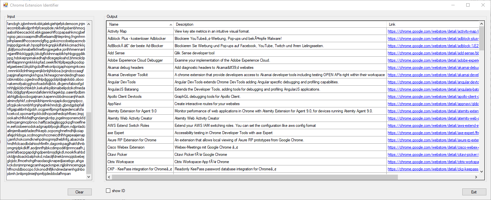
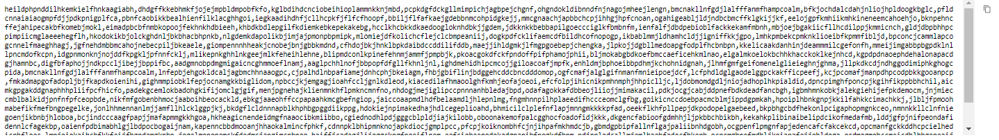
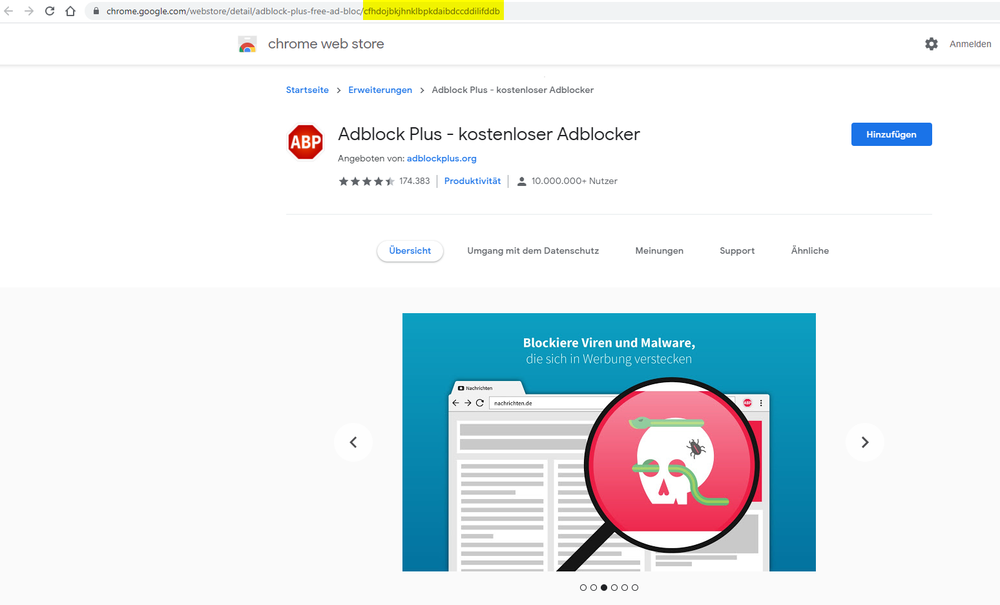

# ChromeExtensionIdentifier

The **ChromeExtensionIdentifier** retrieves detailed information about a chrome extension only given by ID.
Multiple IDs can be given as list.

## Features

 * retrievesinformation about a chrome extension by given ID
 * URL to Chrome web store site generated
 * multiple IDs can be checked at one step

## Screenshots

## System requirements

 * For Windows: .NET Framework 4.7.2 or higher

## Installation

 1. Download the source code from GitHub.com
 2. Compile project with Visual Studio.
 3. Run it.

## Configuration and Options

 * Row with ID can be toggled
 * Sorting in result grid possible
